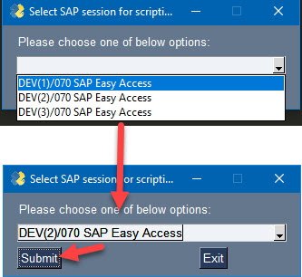

# SapGuiRpa

I'm making this repository public as I think that it might help some SAP consultants with their work. I personally use this for developing my own scripts for various cases such as:
 - process testing
 - master or transactional data maintenance where BAPI or LSMW cannot help
 - new plant code creation with additional setting, especially EC02 technical log scrapping
 - as implied, scraping data of tables where export to excel is not available (especially during active scripting)
 - transactional data creation for new functionality testing (if not using GUI's built-in recording tool)
 - prototyping of RPA(RDA) robots

Please note that the documentation of the code is not the best. The code can be optimized and some parts can be changed for better readability, but before I get to that (and if), I will appreciate any comments or ideas. Questions are welcomed as well :). 

### Quick usage from a command line:
```python
>>> from sapguirpa import SapGuiRpa
>>> sap = SapGuiRpa()
>>> sap.attach_to_session(mode="gui")
```
PySimpleGui is used for GUI windows, but I plan switching to standard library tkinter in future.




If mode is not provided to method "attach_to_session", you are prompt for session selection via CLI.
```python
>>> sap.attach_to_session()
These session are available:
    1.    DEV(1)/070 SAP Easy Access
    2.    DEV(2)/070 SAP Easy Access
    3.    DEV(3)/070 SAP Easy Access
Please provide corresponding number one of above items:2
```

And then you can use any of defined methods:
```python
>>> sap.start_transaction("ME21N")
```
